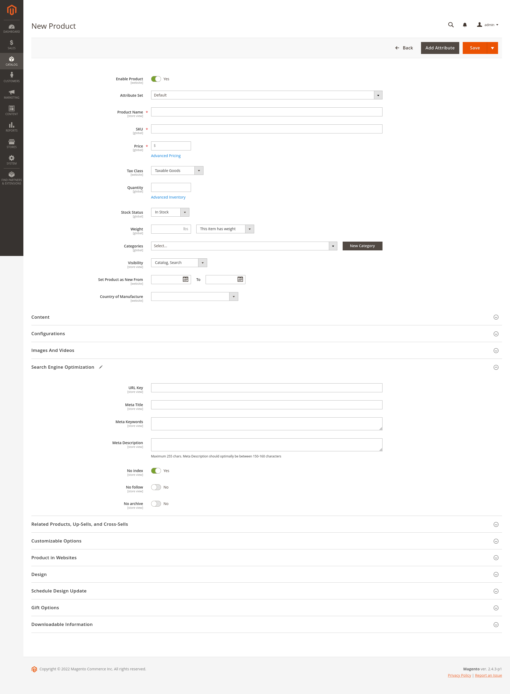
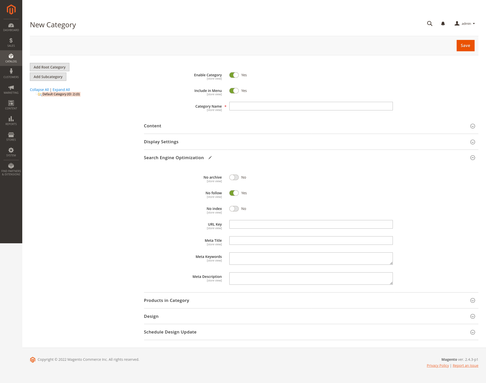
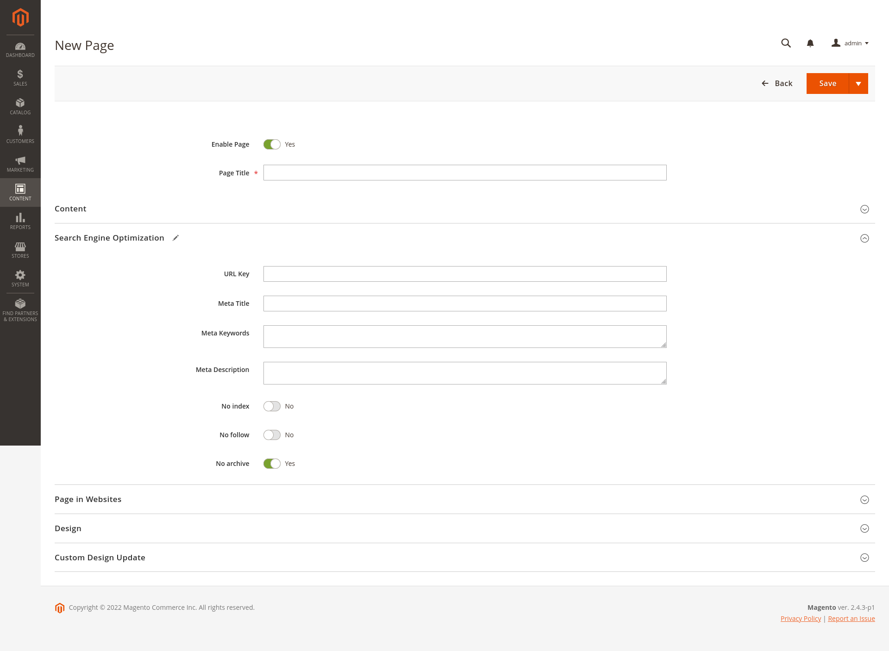
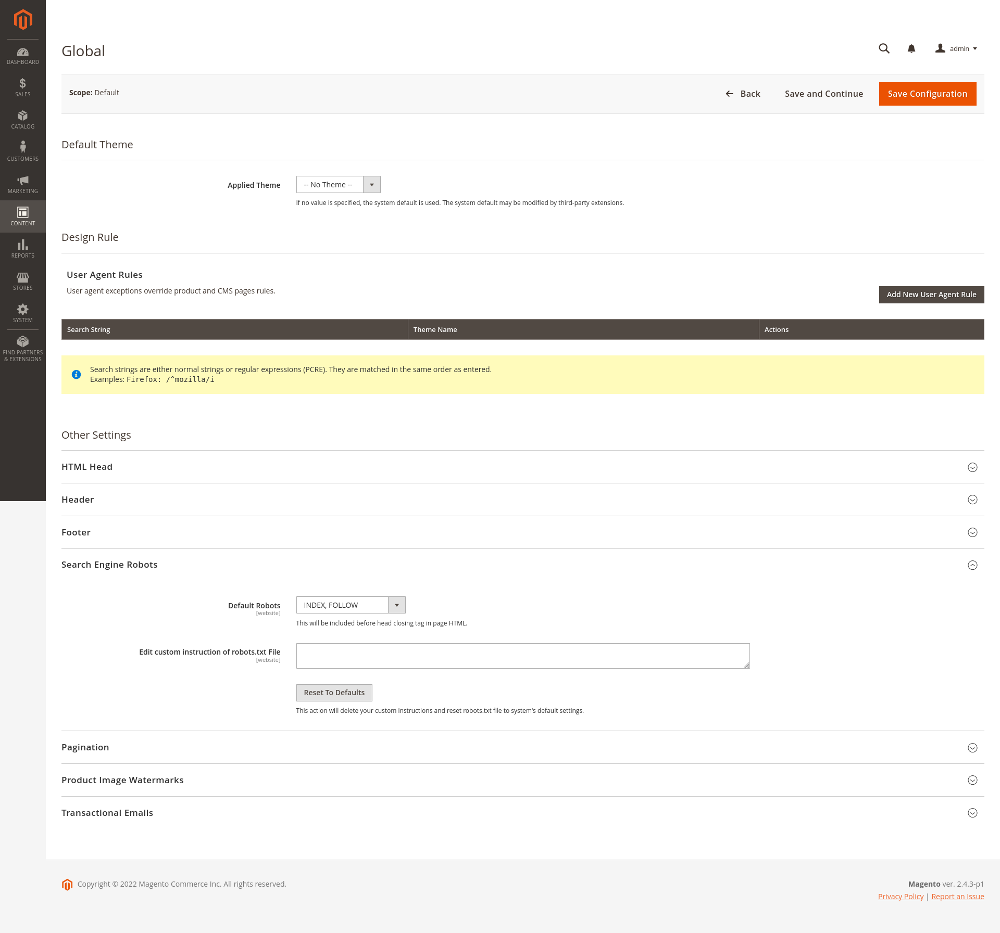

# NoIndex NoFollow NoArchive Tag
NoIndex NoFollow NoArchive Tag Magento2 extension

### Installation
- Composer:
```
composer require tidycode/meta-robots-tag
```
- Downloading module:
```
Download module from GitHub and copy/paste it under dir your_magento_root/app/code/Tidycode/MetaRobotsTag
```

After installation, enable the module
```
bin/magento module:enable Tidycode_MetaRobotsTag
```
upgrade your database:
```
bin/magento setup:upgrade
```
and compile the Magento dependency injection:
```
bin/magento setup:di:compile
```

### Usage
Now you can find 3 new attributes in the "Search Engine Optimization" section of products, categories and CMS Page







By enabling the flag in one of the options, the option will be forced to "no" for that entity

**Warning: if the option is not flagged, it does not mean that it will be forced to "yes", but default the configuration in the design settings will be used.**

